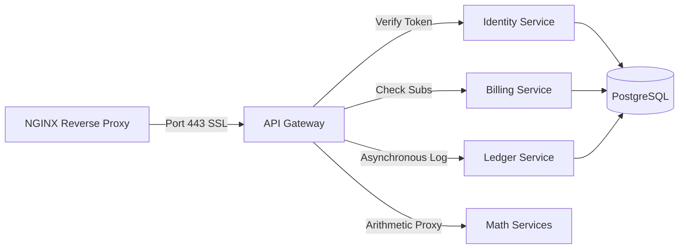

# MaaS Study Refresher & Guide

Welcome back! This document serves as your customized refresher, structured by your study priorities: **Infrastructure & DevOps first, followed by Backend Architecture, and lastly the Frontend Client layer**. It directly connects the concepts in [MANUAL_NOTES.md](file:///C:/Users/Sean Ligon/Desktop/Portfolio/MaaS/MANUAL_NOTES.md) and [CODEBASE_STUDY_PROGRESS.md](file:///C:/Users/Sean Ligon/Desktop/Portfolio/MaaS/CODEBASE_STUDY_PROGRESS.md) to their implementation files in the repository.

---

## 1. PRIORITY 1: Infrastructure & DevOps

This layer defines how the MaaS services are packaged, built, and deployed to the cloud, using **Infrastructure as Code (IaC)** and **CI/CD pipelines**.

### Core Architecture Components
*   **Infrastructure as Code (IaC)**: Configured in [infra/terraform/main.tf](file:///C:/Users/Sean Ligon/Desktop/Portfolio/MaaS/infra/terraform/main.tf). You have defined:
    *   **Azure VM**: The host server instance where docker containers will run.
    *   **Virtual Network (VNet) & Subnet**: Define internal networking namespaces.
    *   **Network Security Group (NSG)**: Configures firewalls restricting all traffic except standard HTTP (Port 80) and HTTPS (Port 443).
    *   **Network Interface (NIC) & Public IP**: Wire the VM to the NSG and give it a public-facing IP.
    *   **Azure Container Registry (ACR)**: Private registry to store built Docker images. `admin_enabled = true` is configured to allow username/password credentials.
*   **CI/CD Workflows**: Configured inside [.github/workflows/](file:///C:/Users/Sean Ligon/Desktop/Portfolio/MaaS/.github/workflows/).
    *   **Linting & Style**: [.github/workflows/lint.yaml](file:///C:/Users/Sean Ligon/Desktop/Portfolio/MaaS/.github/workflows/lint.yaml) runs linters (Ruff/Node) on PRs.
    *   **Automated Testing**: [.github/workflows/unit-tests.yaml](file:///C:/Users/Sean Ligon/Desktop/Portfolio/MaaS/.github/workflows/unit-tests.yaml) installs development requirements (`requirements-dev.txt`) and runs unit tests.
    *   **Docker Build & Push**: [.github/workflows/deploy-image.yaml](file:///C:/Users/Sean Ligon/Desktop/Portfolio/MaaS/.github/workflows/deploy-image.yaml) builds Dockerfiles upon merge to `master`, authenticates with ACR credentials, and pushes the tagged images.

### Key Infrastructure CLI Commands
Execute these within [infra/terraform/](file:///C:/Users/Sean Ligon/Desktop/Portfolio/MaaS/infra/terraform/):
```bash
# Initialize directories and download Azure provider modules
terraform init

# Check code syntax and clean up indentation
terraform fmt

# Preview infrastructure modifications (dry-run)
terraform plan

# Create or modify the resources on Azure
terraform apply

# Destroy all resources provisioned by the configuration
terraform destroy
```

### Next Study Goal: Remote State Backend
Currently, your Terraform state file (`terraform.tfstate`) resides locally on your system. This is a production risk because:
1.  CI/CD runners cannot view the state, preventing them from safely running plans.
2.  Parallel runs can cause state corruption or overwrite conflicts.
*   **Next Step**: Learn to bootstrap an Azure Blob Storage backend. Add a `backend "azurerm"` block to your configuration to store the state file in a cloud storage container, enabling state locking and state sharing.

---

## 2. PRIORITY 2: Backend Architecture & Services

This layer covers the microservices cluster, inter-service networking, APIs, data persistence, and security controls.



### Core Architecture Components
*   **Centralized API Gateway**: Written in FastAPI at [services/api-gateway/main.py](file:///C:/Users/Sean Ligon/Desktop/Portfolio/MaaS/services/api-gateway/main.py). Instead of repeating security logic, the gateway validates incoming JWT tokens, manages client rate limits, proxies requests to internal services, and issues event logs.
*   **Private Microservices**: Internal servers sit behind the gateway.
    *   **Identity Service**: Configured at [services/identity/main.py](file:///C:/Users/Sean Ligon/Desktop/Portfolio/MaaS/services/identity/main.py). Handles user signup, password hashing, and token issuance.
    *   **Billing Service**: Configured at [services/billing/main.py](file:///C:/Users/Sean Ligon/Desktop/Portfolio/MaaS/services/billing/main.py). Handles subscription creation, payment intent verification, and webhook callbacks from Xendit.
    *   **Ledger Service**: Configured at [services/ledger/main.py](file:///C:/Users/Sean Ligon/Desktop/Portfolio/MaaS/services/ledger/main.py). Journalizes operation results.
    *   **Math Services**: Four separate FastAPI directories (e.g. `services/math-add/`) that compute calculations.
*   **NGINX SSL/TLS Termination**: Configured in [services/nginx/nginx.conf](file:///C:/Users/Sean Ligon/Desktop/Portfolio/MaaS/services/nginx/nginx.conf). Redirects Port 80 traffic to Port 443, terminates TLS using self-signed certificates, and routes traffic inside the Docker network.
*   **Orchestration & Healthchecks**: Configured in [docker-compose.yml](file:///C:/Users/Sean Ligon/Desktop/Portfolio/MaaS/docker-compose.yml).
    *   **Service Name Resolution**: Network connections use service aliases (e.g., `http://identity:8000`).
    *   **Healthchecks**: The database uses `pg_isready` (see [docker-compose.yml:L116-L121](file:///C:/Users/Sean Ligon/Desktop/Portfolio/MaaS/docker-compose.yml#L116-L121)). Dependent microservices use `condition: service_healthy` to postpone startup until the database is ready.
*   **Dependency Management**: Production dependencies are declared in `requirements.txt` files inside each service directory. Test requirements go into `requirements-dev.txt`.

### Key Backend CLI Commands
**Docker & Compose**:
```bash
# Build images and start all containers in the background
docker compose up -d --build

# Inspect the status and health of running containers
docker compose ps

# Review container output logs
docker compose logs -f

# Stop and delete containers and internal networks
docker compose down

# Destroy containers and delete the PostgreSQL database volume (wipes DB state)
docker compose down -v

# Run interactive commands inside a running container
docker compose exec postgres psql -U postgres -d ledger_db
```
**Python & Testing (Billing Service Example)**:
```bash
# Run pytest directly from a service directory
cd services/billing
pytest tests/test_billing_api.py::test_name

# Run pytest through the workspace filter from the root
pnpm --filter billing test -- tests/test_billing_api.py::test_name
```

---

## 3. PRIORITY 3: Frontend Client Layer

The frontend provides the user interface for interacting with the backend APIs.

### Core Architecture Components
*   **Next.js Workspace**: Located at [apps/web/](file:///C:/Users/Sean Ligon/Desktop/Portfolio/MaaS/apps/web/). Uses the Next.js App Router.
*   **Layouts & Shells**: Under `app/`, layouts handle persistent user dashboards, authentication banners, and navigation controls.
*   **State & Cookies**: Manage user authentication headers and session states internally using token helper functions under `app/_lib/`.
*   **Animations**: Built using `framer-motion` to create rich, responsive transitions during navigation and form validation.
*   **API Interceptor Routing**: The frontend must call the **API Gateway** (`http://localhost:4000/api/`) or NGINX edge rather than internal FastAPI services.

### Key Frontend CLI Commands
Execute these in the repository root directory:
```bash
# Install workspace dependencies (monorepo packages)
pnpm install

# Spin up Next.js web application and active services in development mode
pnpm dev

# Execute unit tests for the frontend app
pnpm --filter web test
```

---

## Summary of Reference Locations
*   **Docker Orchestration**: [docker-compose.yml](file:///C:/Users/Sean Ligon/Desktop/Portfolio/MaaS/docker-compose.yml)
*   **Nginx Edge Rules**: [services/nginx/nginx.conf](file:///C:/Users/Sean Ligon/Desktop/Portfolio/MaaS/services/nginx/nginx.conf)
*   **Terraform Resources**: [infra/terraform/main.tf](file:///C:/Users/Sean Ligon/Desktop/Portfolio/MaaS/infra/terraform/main.tf)
*   **Gateway Logics**: [services/api-gateway/main.py](file:///C:/Users/Sean Ligon/Desktop/Portfolio/MaaS/services/api-gateway/main.py)
*   **Your Personal Notes**: [MANUAL_NOTES.md](file:///C:/Users/Sean Ligon/Desktop/Portfolio/MaaS/MANUAL_NOTES.md)
*   **Historical Commit Progress**: [CODEBASE_STUDY_PROGRESS.md](file:///C:/Users/Sean Ligon/Desktop/Portfolio/MaaS/CODEBASE_STUDY_PROGRESS.md)
