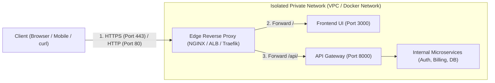

# Edge Networking, Reverse Proxies, and Ingress: Universal DevOps Guide

This guide covers the fundamental, cloud-agnostic concepts of **Edge Networking, Ingress, and Reverse Proxies**. These principles apply universally across on-premise servers, cloud load balancers (AWS ALB, Azure Application Gateway), container environments, and Kubernetes ingress controllers.

---

## 1. What is an Ingress / Reverse Proxy?

In modern cloud architecture, backend microservices and databases are never exposed directly to the public internet. Instead, all incoming traffic flows through an **Ingress / Reverse Proxy Layer** at the network perimeter.



### Core Responsibilities of the Edge Layer:
1. **Single Public Surface**: Only ports `80` (HTTP) and `443` (HTTPS) are exposed. All backend services stay on private, unroutable IP addresses.
2. **Attack Surface Reduction**: Protects backend application runtimes (FastAPI, Node.js, Spring) from direct exposure to internet port scans and malformed packets.
3. **SSL/TLS Offloading (Termination)**: Handles intensive cryptographic handshakes at the edge so internal microservices communicate via lightweight HTTP.
4. **Unified Entry Routing**: Routes requests to completely different underlying servers and containers based on URL paths (`/api/*` vs `/*`) or domain names.

### Forward Proxy vs. Reverse Proxy (Interview Distinction)

| Attribute | Forward Proxy (Egress) | Reverse Proxy (Ingress) |
| :--- | :--- | :--- |
| **Who it protects** | **The Client** (Hides users from internet) | **The Server** (Hides backend from internet) |
| **Where it sits** | In front of internal clients | In front of internal backend servers |
| **Traffic Direction** | Outbound (Client ➔ Internet) | Inbound (Internet ➔ Backend) |
| **Real-world Example** | Corporate VPN, School Web Filter | NGINX, AWS ALB, Cloudflare, Traefik |

---

## 2. Layer 4 vs. Layer 7 Proxying

Proxies operate at different layers of the OSI model, with massive trade-offs between speed and routing intelligence:

```text
Layer 7 (Application) : Reads HTTP paths, headers, cookies, verbs. Intelligent routing.
Layer 4 (Transport)   : Reads IP addresses and TCP/UDP ports only. Raw throughput.
```

### Comparison Matrix

| Feature | Layer 4 (Transport Layer) | Layer 7 (Application Layer) |
| :--- | :--- | :--- |
| **Routing Criteria** | IP address and Port (`10.0.0.4:5432`) | URL path (`/api/v1`), domain name, headers |
| **Payload Inspection** | Blind (cannot inspect HTTP, JSON, or TLS data) | Deep (decrypts TLS, reads headers and body) |
| **Performance** | Extremely fast, minimal CPU overhead | Higher CPU usage due to parsing and decryption |
| **Use Cases** | Databases (PostgreSQL/MySQL), Gaming, VoIP, TCP streaming | Web applications, REST APIs, Microservices, gRPC |
| **Cloud Examples** | AWS Network Load Balancer (NLB), Azure Load Balancer | AWS Application Load Balancer (ALB), Azure App Gateway |

---

## 3. SSL/TLS Architecture & The Trust Chain

### Key Concepts
* **Public Key Infrastructure (PKI)**: Relies on an asymmetric key pair:
  * **Certificate (`.crt` / `.pem`)**: Publicly shared with clients; contains your domain name and public key.
  * **Private Key (`.key` / `-key.pem`)**: Strictly secret on the server; decrypts data encrypted by the public key.
* **Certificate Authority (CA)**: A trusted third party (e.g., Let's Encrypt, DigiCert) that cryptographically signs your public certificate, proving you own the domain.

### TLS Termination vs. TLS Pass-through vs. mTLS

```mermaid
flowchart TD
    subgraph Termination ["1. TLS Termination (Standard Web Apps)"]
        C1["Client"] -->|"HTTPS (Encrypted)"| P1["Edge Proxy"]
        P1 -->|"HTTP (Plaintext in Private VPC)"| B1["Backend Service"]
    end

    subgraph PassThrough ["2. TLS Pass-Through (High Compliance / Banking)"]
        C2["Client"] -->|"HTTPS (Encrypted)"| P2["Layer 4 Proxy (Blind)"]
        P2 -->|"HTTPS (Still Encrypted)"| B2["Backend Service (Decrypts here)"]
    end

    subgraph MTLS ["3. Mutual TLS / mTLS (Zero-Trust Service Mesh)"]
        S1["Service A"] <-->|"Both verify each other's certificates"| S2["Service B"]
    end
```



---

## 4. Traffic Routing & Upstream Management

### Routing Methods
1. **Host-Based Routing (SNI - Server Name Indication)**:
   * A single proxy with one public IP routes traffic based on the requested domain:
     * `app.example.com` ➔ Routes to Frontend Container
     * `api.example.com` ➔ Routes to Backend Container
2. **Path-Based Routing**:
   * Routes traffic based on the URI prefix:
     * `https://example.com/api/*` ➔ Routes to API Gateway
     * `https://example.com/*` ➔ Routes to Static Website

### Load Balancing Algorithms

| Algorithm | How It Works | Best Used For |
| :--- | :--- | :--- |
| **Round Robin** | Sequentially sends requests to server A, B, C, A... | Identical servers with similar task workloads |
| **Least Connections** | Sends request to the server with the fewest active connections | Long-running queries or uneven request processing times |
| **IP Hash (Sticky)** | Hashes the client's IP so the same client always reaches the same server | Stateful applications relying on in-memory user sessions |

---

## 5. Security & Zero-Trust Header Preservation

Because a reverse proxy sits between the client and backend, **backend services naturally see the proxy's IP address, not the client's real IP**. 

To preserve client context and protect the network, proxies must forward standardized headers:

```nginx
# Standard Header Forwarding Snippet
proxy_set_header Host $host;
proxy_set_header X-Real-IP $remote_addr;
proxy_set_header X-Forwarded-For $proxy_add_x_forwarded_for;
proxy_set_header X-Forwarded-Proto $scheme;
```

### Why Each Header Is Mandatory:
* **`Host $host`**: Ensures the backend knows the actual domain name the user typed into their browser (crucial for virtual hosting and password-reset email links).
* **`X-Real-IP` & `X-Forwarded-For`**:
  * Tells backend services the actual public IP address of the user.
  * Essential for rate-limiting, fraud detection, geolocation, and security audit logs.
* **`X-Forwarded-Proto $scheme`**:
  * Informs the backend whether the user originally connected via `http` or `https`.
  * Prevents infinite redirect loops and enables backend frameworks to enforce `Secure` cookies.

> [!WARNING]
> **Header Spoofing Hazard**: Untrusted clients can inject fake `X-Forwarded-For: 127.0.0.1` headers to bypass IP whitelists. Edge proxies must be configured to overwrite or properly append to incoming forwarding headers.

---

## 6. HTTP Troubleshooting Matrix for DevOps

When testing and troubleshooting proxy configurations using `curl -I`:

| Status Code | Label | Meaning in a Reverse Proxy Architecture |
| :--- | :--- | :--- |
| **`301` / `302`** | Redirect | HTTP port 80 successfully forwarded client to HTTPS port 443. |
| **`400`** | Bad Request | Client sent malformed headers or payload rejected by edge validation. |
| **`404`** | Not Found | Proxy reached the backend, but the backend application has no matching route. |
| **`405`** | Method Not Allowed | The route exists, but was called with the wrong HTTP verb (e.g., `HEAD` or `GET` instead of `POST`). **Proves the proxy path is working!** |
| **`502`** | Bad Gateway | **The backend is down.** Proxy is running, but the backend service refused connection (service crashed, wrong port, or container offline). |
| **`504`** | Gateway Timeout | **The backend is too slow.** Proxy reached the backend, but backend did not respond within `proxy_read_timeout` (e.g., hung DB query). |

---

## 7. Diagnostics Command Reference: `curl`

DevOps engineers diagnose APIs and edge networks directly from the terminal:

```bash
# 1. Inspect HTTP response headers only (suppress response body)
curl.exe -I http://localhost/

# 2. Test HTTPS while ignoring local self-signed certificate errors
curl.exe -k -I https://localhost/api/v1/auth/register

# 3. Follow redirects automatically (e.g. follow 301 to final destination)
curl.exe -k -L https://localhost/

# 4. Measure connection and response timing breakdown
curl.exe -k -o /dev/null -s -w "DNS: %{time_namelookup}s | Connect: %{time_connect}s | TTFB: %{time_starttransfer}s | Total: %{time_total}s\n" https://localhost/api/v1/auth/register
```

---

## 8. Career Translation: Local vs. Cloud vs. Kubernetes

The tool names change across your career, but the architecture remains identical:

| Architectural Role | Local Docker Setup | Azure / AWS Cloud | Kubernetes / Cloud Native |
| :--- | :--- | :--- | :--- |
| **Edge Ingress / Reverse Proxy** | `services/nginx` | Azure Application Gateway / AWS ALB | Ingress-NGINX / Traefik Controller |
| **Service Discovery / DNS** | Docker Compose DNS (`api-gateway:8000`) | Azure Private DNS / AWS Cloud Map | Kubernetes CoreDNS (`service.namespace`) |
| **Certificate Management** | Self-signed PEM files | Azure Key Vault / AWS ACM | Cert-Manager (Let's Encrypt automated) |
| **Zero-Trust Service-to-Service** | Direct Docker networking | Azure Service Fabric / AWS App Mesh | Istio / Linkerd Service Mesh (mTLS) |
| **Edge Protection / WAF** | NGINX rate-limiting rules | Azure Front Door / AWS WAF | Cloudflare Tunnel / Coraza WAF |
